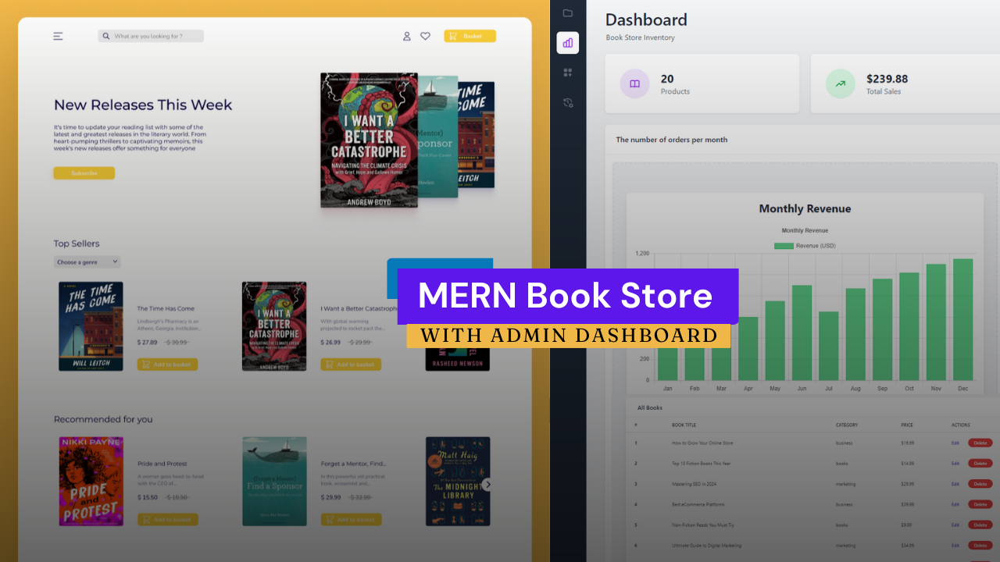

# Full-Stack Book Store Application (MERN)



## 📜 Project Overview

This project is a full-stack **Book Store Application** built using the MERN stack. It allows users to browse, purchase, and manage their book collections. The frontend is developed with React and Vite, while the backend uses Express.js and MongoDB.

---

## **Table of Contents**

- [Features](#features)
- [Tech Stack](#tech-stack)
- [Setup Instructions](#setup-instructions)
  - [Frontend Setup](#frontend-setup)
  - [Backend Setup](#backend-setup)
- [Scripts](#scripts)
- [Author](#author)
- [License](#license)

---

## **Features**

- **User Authentication:**
  - Secure login and registration using Firebase Authentication.
- **Book Management:**
  - View book listings, categories, and details.
  - Add books to a personal collection or shopping cart.
- **Responsive Design:**
  - Fully responsive UI for seamless access across devices.
- **Backend Integration:**
  - RESTful API for secure communication between frontend and backend.
- **Data Security:**
  - Passwords secured using JWT for session management.

---

## 🛠️ **Tech Stack**

### **Frontend**

- **React**: UI development.
- **Vite**: Fast development build tool.
- **Firebase**: Authentication and real-time data handling.

### **Backend**

- **Express.js**: Web server framework.
- **MongoDB**: Database for storing application data.
- **Mongoose**: Object Data Modeling (ODM) for MongoDB.
- **JWT**: Token-based authentication.
- **dotenv**: Environment variable management.

---

## **Setup Instructions**

### **Frontend Setup**

1. **Navigate to the Frontend Directory:**
   ```bash
   cd frontend

Create a .env.local file with Firebase credentials
envCopyVITE_API_KEY="your-firebase-api-key"
VITE_AUTH_DOMAIN="your-firebase-auth-domain"
VITE_PROJECT_ID="your-firebase-project-id"
VITE_STORAGE_BUCKET="your-firebase-storage-bucket"
VITE_MESSAGING_SENDER_ID="your-firebase-sender-id"
VITE_APP_ID="your-firebase-app-id"

Install dependencies
bashCopynpm install

Start the development server
bashCopynpm run dev

Access the app at http://localhost:5173

Backend Setup

Navigate to the backend directory
bashCopycd backend

Create a .env file with MongoDB and JWT configurations
envCopyDB_URL="your-mongodb-connection-string"
JWT_SECRET_KEY="your-jwt-secret-key"

Install dependencies
bashCopynpm install

Start the backend server
bashCopynpm run start:dev

Ensure MongoDB is running and replace DB_URL with your credentials

📜 Scripts
Frontend Scripts
ScriptDescriptionnpm run devStart development servernpm run buildBuild production-ready appnpm run previewPreview production build
Backend Scripts
ScriptDescriptionnpm run startStart server in production modenpm run start:devStart server in development mode
👤 Author

Name: Akash Deep
Email: contact.akashdeep023@gmail.com
LinkedIn: Akash Deep

📄 License
This project is licensed under the MIT License.

Happy Coding! 🚀📖

This README provides a comprehensive overview of your Full-Stack Book Store Application. It includes:

- An attractive project cover image
- Detailed feature descriptions
- Tech stack with badges
- Clear setup instructions for both frontend and backend
- Script descriptions
- Author information
- License details

Feel free to customize it further to match your specific project requirements. The markdown is formatted for maximum readability and includes helpful sections to guide potential users and contributors.
